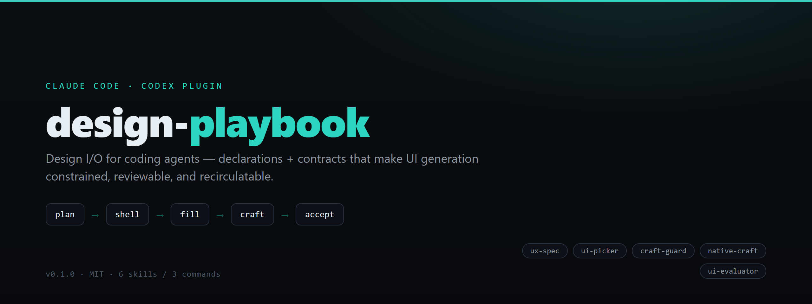

<div align="center">



# 🎴 design-playbook

### *给 coding agent 的 Design I/O — 用声明 + 契约让 UI 生成可控、可验收、可回流。*

[](.#)
[](./packages/design-playbook/LICENSE)
[](.#)
[](.#)
[](.#)
[](./packages/design-playbook/codex/AGENTS.md)

*不是又一套风格/色板库。与 `ui-ux-pro-max` + `frontend-design` 互补；本插件管**链路与验收**。*

</div>

---

## ✨ 它是什么

Claude Code / Codex 插件。每次跑同一条可预测链路 — **Design I/O**：`ux-spec? → plan? → (native-craft?) → ui-picker → (preview*) → fill → craft-guard → (observe*) → ui-evaluator`，验收把每个问题**指回**所属声明，blocking 必须**回流**直到闭环。`?` 为条件入场；`preview*`/`observe*` 仅在对应可选 MCP 工具（`preview_prototype` / `execute_capture_plan`）存在时运行，否则跳过直进下一阶段。

- **声明** *（什么是好）*：`spec` · `domain` · `craft` · `design` · `components` · `template`
- **契约** *（怎么进链路）*：`skill`（时机）· `evaluator`（验收 + 回流）

> 🎬 **真实项目实跑**：[`showcase/`](./packages/design-playbook/showcase) 是对 [SwarSight](https://github.com/) 的一次完整 Design I/O 实测 — spec、决策报告、point-back 评审 + 闭环回流轨迹。

## 📦 安装

```text
/plugin marketplace add <owner>/<repo>
/plugin install design-playbook@design-playbook
```

<details>
<summary>本地开发 / 自测</summary>

marketplace catalog 在**仓库根目录**（不在 package 内）：

```text
claude --plugin-dir <绝对路径>/packages/design-playbook      # 开发加载，免安装
/plugin marketplace add <仓库根绝对路径>                     # 本地 marketplace
/plugin install design-playbook@design-playbook
```

</details>

调用一律**带命名空间**：`/design-playbook:design-io <需求>`。裸 `/design-io` 仅 `--plugin-dir` 开发态别名。

## 🧩 Skills 与命令

六个 model 触发 skill（`/design-playbook:<名>`）：

| Skill | 职责 |
| :--- | :--- |
| `design-playbook` | 🎯 编排（全链路） |
| `ux-spec` | 📋 六层 spec 声明 |
| `ui-picker` | 🧱 骨架 + 组件语义 |
| `craft-guard` | 🛡️ 工艺 / 反 AI 味 |
| `native-craft` | 🖥️ 桌面原生手感声明 |
| `ui-evaluator` | ✅ point-back 验收 + 回流 |

**命令**：`design-io`（全链路）· `ux-spec`（只出 spec）· `ui-review`（只验收）

## 🔗 与生态组合

| 包 | 用来做 |
| :--- | :--- |
| **design-playbook** | 规格? → plan? → 骨架 → 可选 preview* → 填充 → 工艺 → 可选 observe* → point-back |
| [ui-ux-pro-max](https://github.com/nextlevelbuilder/ui-ux-pro-max-skill) | 风格 / 色板 / 字体检索 |
| `frontend-design` | 反模板视觉方向 |
| [native-feel-skill](https://github.com/yetone/native-feel-skill) | 原生手感深度（WebView、IPC、内存） |

## 🗂️ 目录结构

```text
.claude-plugin/marketplace.json   ← 仓库根 catalog（source: ./packages/design-playbook）
packages/design-playbook/         ← 公开插件（skills、commands、examples、showcase、LICENSE、NOTICE）
docs/agents/  docs/adr/           ← 工程壳（tracker、workflow、决策）
CONTEXT.md  .scratch/             ← 词汇表、spec、票、dogfood 日志
```

仓库根 = GitHub 门面 + 工程壳 · package = 唯一运行时表面 · `product-*` 维护命令只留根，绝不进 package。

## 📄 许可

MIT（原创内容）。见 [`LICENSE`](./packages/design-playbook/LICENSE) + [`NOTICE`](./packages/design-playbook/NOTICE)。不主张任何第三方 playbook 内容的权利。

---

<div align="center">

[English](README.md) · [实测展示](./packages/design-playbook/showcase) · [Workflow](./docs/agents/product-workflow.md)

</div>
