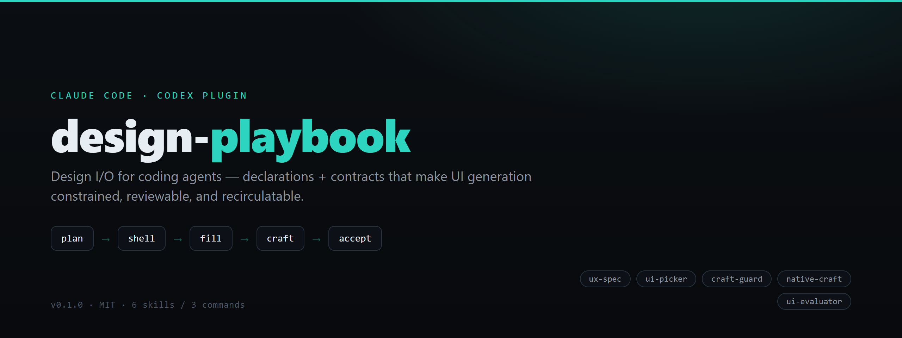
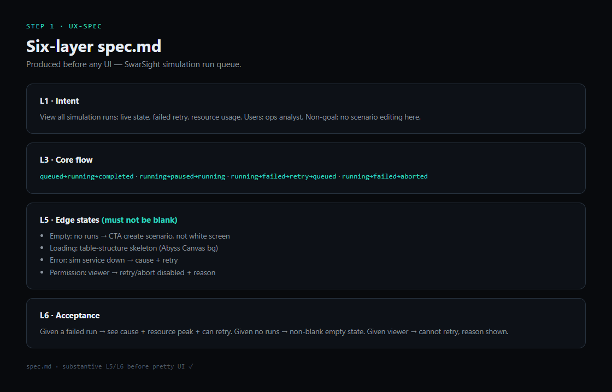
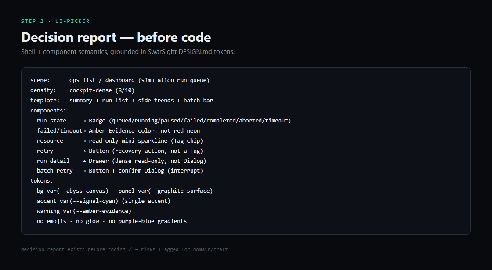
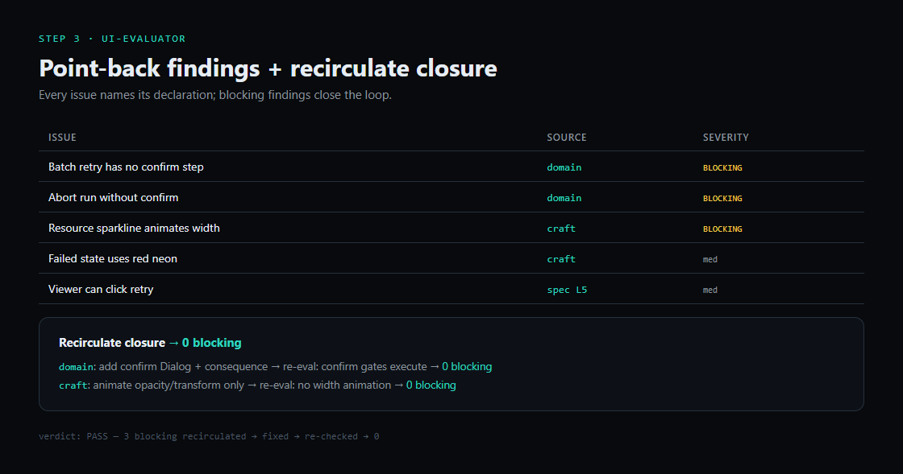
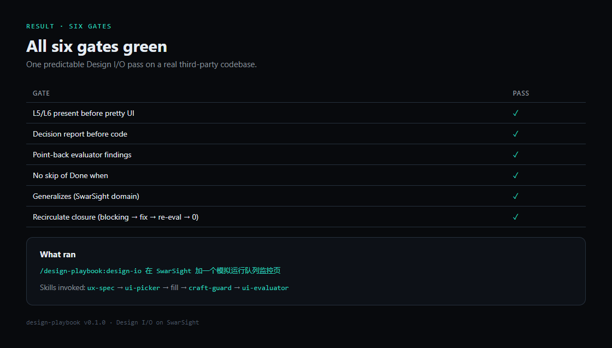

<div align="center">



# 🎴 design-playbook

### *Agent 交付的 UI 没人能验证。这个插件让它拿出证据。*

[](.#)
[](./packages/design-playbook/LICENSE)
[](.#)
[](.#)
[](.#)
[](./packages/design-playbook/codex/AGENTS.md)

先声明什么是好，再对着声明生成，最后对着同一份声明验收——
每个问题都指回拥有它的那份 spec、领域规则或工艺规则。

*不是又一套风格/色板库。与 `ui-ux-pro-max` + `frontend-design` 互补；本插件管**交付链路、证据语义与验收闭环**。*

</div>

---

## ⚡ 一条链路跑到底

每个 run 执行同一条可预测的 **Design I/O** 链路：

```text
design-baseline? → reference-intake? → ux-spec? → plan? → (native-craft?)
  → ui-picker → (preview*) → fill → craft-guard† → (observe*†) → ui-evaluator†
                              ▲                                       │
                              └────────────── recirculate ───────────┘
```

| 标记 | 含义 |
| :--- | :--- |
| `?` | 条件入场——已有产品的 UI 修改先跑 `design-baseline?`；需求里带截图 / URL / 类比时再跑 `reference-intake?` |
| `*` | 适配器阶段——仅在其打包的 MCP 工具注册时运行；否则跳过，绝不硬报错 |
| `†` | 用户可选审计阶段（ADR-0033）——首次运行问一次，选择记入 `.design-playbook/preferences.yaml`（版本化；本机覆盖写在 gitignore 的 `preferences.local.yaml`） |

验收是 **point-back**：每个发现都点名拥有它的声明，blocking 发现**回流**到该阶段直到闭环。跳过 `ui-evaluator†` 仍会产出 point-back 骨架——但标记 `audited: false`，strict 校验不把它当已审计结果放行。Agent 永远不能悄悄给自己的作业打分。

## 🎬 试一把

**Claude Code**

```text
/plugin marketplace add https://github.com/Bandersnatch0x/design-playbook.git
/plugin install design-playbook@design-playbook
```

**Codex**

```bash
codex plugin marketplace add Bandersnatch0x/design-playbook
codex plugin add design-playbook@design-playbook
```

然后带命名空间调用（裸 `/design-io` 仅是 `--plugin-dir` 开发态别名）：

```text
/design-playbook:design-io <你的 UI 需求>
```

一次通过在 `.scratch/<run>/` 落下三样产物：

1. **`spec.md`**——六层的"什么是好"声明（意图 → 验收）
2. **决策报告**——骨架 + 组件语义，写在任何代码之前
3. **Point-back 台账**——验收发现（各自点名 owning 声明）+ 闭环轨迹

Codex 安装细节、marketplace 不可用时的 `[mcp_servers.*]` 直配 fallback、preview 前置条件：见 [`packages/design-playbook/codex/AGENTS.md`](./packages/design-playbook/codex/AGENTS.md)。

<details>
<summary>本地开发 / 自测</summary>

marketplace catalog 在**仓库根目录**（不在 package 内）：

```text
claude --plugin-dir <绝对路径>/packages/design-playbook      # 开发加载，免安装
/plugin marketplace add <仓库根绝对路径>                     # 本地 marketplace
/plugin install design-playbook@design-playbook

codex plugin marketplace add <仓库根绝对路径>
codex plugin add design-playbook@design-playbook
```

</details>

## 📸 眼见为实

对 [SwarSight](./packages/design-playbook/showcase) 的一次完整实跑——真实第三方工作台，一行需求，每个关键产物都留了底：

| | |
| :---: | :---: |
| **1 · ux-spec**——写 UI 之前的六层 spec | **2 · ui-picker**——写代码之前的决策报告 |
|  |  |
| **3 · ui-evaluator**——point-back + 回流闭环 | **结果**——六项检查全绿 |
|  |  |

完整产物——spec、决策报告、point-back 评审、preview 人工确认演示、dogfood 实跑界面：[`showcase/`](./packages/design-playbook/showcase)。

## 🔒 声明与契约

- **声明** *（什么是好）*：`spec` · `domain` · `craft` · `design` · `components` · `template`
- **契约** *（怎么进链路）*：`skill`（时机）· `evaluator`（验收 + 回流）

## 🧩 Skills 与命令

八个 model 触发 skill（`/design-playbook:<名>`）：

| Skill | 职责 |
| :--- | :--- |
| `design-playbook` | 🎯 编排（全链路；run-profile 档位定档 P1/P2/P3） |
| `design-baseline` | 🧭 初始化发现、校验或从已有 UI 生成项目 `DESIGN.md` 草稿 |
| `reference-intake` | 📎 参考契约（截图/URL/类比 → Keep/Change/Do not copy） |
| `ux-spec` | 📋 六层 spec 声明（S0-S6 成形会话：问题/假设/确认批次 + 会话工件） |
| `ui-picker` | 🧱 骨架 + 组件语义 + R/C/E 设计决策条目 |
| `craft-guard` | 🛡️ 工艺 / 反 AI 味（第一方规则注册表 + 七列审计行） |
| `native-craft` | 🖥️ 桌面原生手感声明 |
| `ui-evaluator` | ✅ 双轨验收（六块 point-back 报告）+ 回流 |

**命令**：`design-io`（全链路）· `ux-spec`（只出 spec）· `ui-review`（只验收）· `run-review`（跨 run 复盘）· `run-status`（阶段与恢复叙述）· `doctor`（安装面健康）

## 🎚️ Run 档位（P1/P2/P3）

每个 run 在 `plan.md` **run-profile** 块声明档位——流程重量与变更后果成正比。代理按声明触碰面判据初判、用户一次确认；**升档自动**（纠偏信号一出现即升档并补走新增环节），降档需用户。

| 档 | 范围 | 门禁面 |
| :--- | :--- | :--- |
| **P1** 点修 | 单一 owning 层 point-back 修复，不触碰 decided 字段 | 注册表子集求值；R4/R5（+R2 行级）路由 |
| **P2** 标准 | 基线内功能变更（新判据、R/C 决策） | 适用谓词全求值；成形会话 + G9/G10 |
| **P3** 全量 | decided 字段修订（supersedes）、结构性重构、E 档决策 | G1-G12 全谱 + 采样矩阵完整执行 |

完整矩阵与重入语义见 [`docs/specs/ui-ux-vnext/loop-prototype.md`](./docs/specs/ui-ux-vnext/loop-prototype.md)。

## 🔌 适配器（随主插件打包）

Preview / Evidence MCP 运行时已放进主插件（`packages/design-playbook/mcp/` +
带 `${CLAUDE_PLUGIN_ROOT}` 的 `.mcp.json`）。marketplace 安装即注册两个工具，
无需第二包；orchestrator 仍会**探测**，宿主无 MCP 工具时跳过对应步骤。

| 适配器 | MCP 工具 | 启用 | 说明 |
| :--- | :--- | :--- | :--- |
| `design-playbook-preview` | `preview_prototype` | `preview*` 人工确认门（G5） | 已打包；需系统 Edge/Chrome 弹窗（缺失回退默认浏览器） |
| `design-playbook-evidence` | `execute_capture_plan` | `observe*` 运行时取证（G6）——需 Playwright + Chromium | 已打包；取证在运行时仍可选 |

文档：[preview](./packages/design-playbook-preview/#install--mcp-config) · [evidence](./packages/design-playbook-evidence/#install--mcp-config)

## 🔗 与生态组合

| 包 | 用来做 |
| :--- | :--- |
| **design-playbook** | 参考? → 规格? → plan? → 骨架 → 可选 preview* → 填充 → 工艺 → 可选 observe* → point-back |
| [ui-ux-pro-max](https://github.com/nextlevelbuilder/ui-ux-pro-max-skill) | 风格 / 色板 / 字体检索 |
| `frontend-design` | 反模板视觉方向 |
| [native-feel-skill](https://github.com/yetone/native-feel-skill) | 原生手感深度（WebView、IPC、内存） |

## 🗂️ 目录结构

```text
.claude-plugin/marketplace.json   ← 仓库根 catalog（source: ./packages/design-playbook）
packages/design-playbook/         ← 公开插件（skills、commands、mcp/、examples、showcase）
packages/design-playbook/mcp/     ← 打包的 Preview + Evidence MCP 运行时
packages/design-playbook-preview/ ← 兼容 launcher + 文档（G5）
packages/design-playbook-evidence/← 兼容 launcher + 文档（G6）
docs/agents/  docs/adr/           ← 工程壳（tracker、workflow、决策）
CONTEXT.md  .scratch/             ← 词汇表、spec、票、dogfood 日志
```

运行产物落在你项目的 `.scratch/<run>/` 下——见[package README](./packages/design-playbook/README.md)与 `SKILL.md` steps 3、5、8。

**维护脚本：** `scripts/doctor.py`（安装健康检查）、`packages/design-playbook/scripts/run_status.py`（从 run 产物推导 status/resume）、`scripts/release.py`（发版门禁）、`scripts/validate.py`（静态插件表面）。

仓库根 = GitHub 门面 + 工程壳 · package = 唯一运行时表面 · `product-*` 维护命令只留根，绝不进 package。

## 🪞 边界与实话

- **多模态**——截图内容理解依赖**宿主模型的视觉能力**。插件本身只做图片登记（locator + SHA-256 + metadata）；无视觉宿主改骑你给的文字说明。
- **Run Console**——规划中：本地单 run 控制台，把已有 run 产物投影成运营者可直接读的意图、来源判定、阻塞来源与下一 owner。尚未发布、不是云端 Workspace、永远不会成为第二运行态权威。
- **证明 vs 形态**——`scripts/validate_run.py` 机检的是 run 产物的*形态*与闭环轨迹；不宣称每个未来 run 自动就是高质量 UI。showcase 是一次被演示的通过，不是统计保证。

## 📄 许可

MIT（原创内容）。见 [`LICENSE`](./packages/design-playbook/LICENSE) + [`NOTICE`](./packages/design-playbook/NOTICE)。不主张任何第三方 playbook 内容的权利。

---

<div align="center">

[English](README.md) · [实测展示](./packages/design-playbook/showcase) · [Releases](./docs/releases) · [Workflow](./docs/agents/product-workflow.md)

</div>
