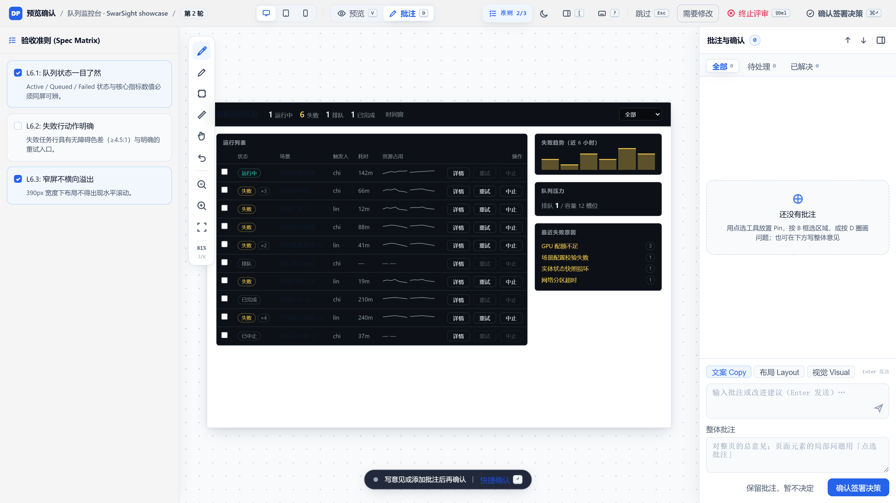

<div align="center">


# 🎴 design-playbook

### *Agents ship UI nobody can verify. This plugin makes them prove it.*

[](https://www.npmjs.com/package/design-playbook)
[](./packages/design-playbook/LICENSE)
[](#-try-it)
[](#-skills--commands)
[](#-skills--commands)
[](./packages/design-playbook/codex/AGENTS.md)

</div>

---

## ⚡ One command, three artifacts

```text
/design-playbook:design-io <your UI ask>
```

One pass — MCP tools bundled, zero extra config — lands three artifacts under `.scratch/<run>/`:

1. **`spec.md`** — the six-layer declaration of what good is (intent → acceptance), written *before* any UI
2. **Decision report** — shell + component semantics, written *before* any code
3. **Point-back ledger** — every acceptance finding states which declaration it violates, plus the closure trail

## 🎬 Try it

**Claude Code**

```text
/plugin marketplace add https://github.com/Bandersnatch0x/design-playbook.git
/plugin install design-playbook@design-playbook
```

**Codex**

```bash
codex plugin marketplace add Bandersnatch0x/design-playbook
codex plugin add design-playbook@design-playbook
```

Then, namespaced (bare `/design-io` is a `--plugin-dir` dev alias only):

```text
/design-playbook:design-io <your UI ask>
```

Codex install notes, the `[mcp_servers.*]` fallback when a marketplace is unavailable, and preview prerequisites: [`packages/design-playbook/codex/AGENTS.md`](./packages/design-playbook/codex/AGENTS.md).

<details>
<summary>Local dev / self-test</summary>

The marketplace catalog lives at the **repo root** (not the package):

```text
claude --plugin-dir <abs>/packages/design-playbook          # dev load, no install
/plugin marketplace add <abs-to-repo-root>                 # local marketplace
/plugin install design-playbook@design-playbook

codex plugin marketplace add <abs-to-repo-root>
codex plugin add design-playbook@design-playbook
```

</details>

## 📸 Evidence, not promises

The agent never quietly grades its own homework:

- **Point-back** — every acceptance finding names the spec, domain, or craft declaration that owns it. No free-floating "looks good".
- **Recirculate** — blocking findings flow back to the owning stage until they close; the closure trail is part of the run artifacts.
- **No silent skip** — skip the audit and the result still carries the point-back skeleton, but marked `audited: false`, which strict validation refuses as a final result.

A full pass against [SwarSight](./packages/design-playbook/showcase) — a real third-party workbench, one ask, every key artifact kept:

| | |
| :---: | :---: |
| **1 · ux-spec** — six-layer spec before any UI | **2 · ui-picker** — decision report before code |
|  |  |
| **3 · ui-evaluator** — point-back + recirculate closure | **Result** — all six gates green |
|  |  |

**Live human-confirm gate (`preview*`)** — the generated prototype renders inside a review workbench: the spec's acceptance criteria sit in a checklist beside it (your ticks are recorded with the decision), and you can click elements, drag highlight boxes, sketch, or measure spacing to anchor feedback — then sign off or send it back for another round:



Full artifacts — spec, decision report, point-back critique, preview human-confirm demo, the live self-test surface: [`showcase/`](./packages/design-playbook/showcase).

## 🔁 The one-pass pipeline

Declare what good is *before* the code exists, generate against that declaration, then accept the result against the same declaration. Every run executes the same predictable **Design I/O** pass:

```text
design-baseline? → reference-intake? → ux-spec? → plan? → (native-craft?)
  → ui-picker → (preview*) → fill → craft-guard† → (observe*†) → ui-evaluator†
                              ▲                                       │
                              └────────────── recirculate ───────────┘
```

Six **declarations** own what good is (`spec` · `domain` · `craft` · `design` · `components` · `template`); two **contracts** govern how work enters the pipeline (`skill` for timing, `evaluator` for acceptance + recirculate).

<details>
<summary>Marker legend (<code>?</code> / <code>*</code> / <code>†</code>)</summary>

| Marker | Meaning |
| :--- | :--- |
| `?` | Conditional entry — `design-baseline?` for UI work in an existing product; `reference-intake?` when the ask carries a screenshot / URL / analogy |
| `*` | Adapter stage — runs only when its bundled MCP tool is registered; otherwise skipped, never a hard error |
| `†` | user-selectable audit stage (decision record [ADR-0033](./docs/adr/0033-audit-acceptance-user-preferences.md)) — asked once on first run, remembered in `.design-playbook/preferences.yaml` (version-controlled; per-machine overrides in gitignored `preferences.local.yaml`) |

</details>

## 🧩 Skills & commands

Eight model-invoked skills (`/design-playbook:<name>`):

| Skill | Role |
| :--- | :--- |
| `design-playbook` | 🎯 Orchestrator (full pipeline, run-profile tiering P1/P2/P3) |
| `design-baseline` | 🧭 Discover, validate, or draft project `DESIGN.md` before existing-product UI work |
| `reference-intake` | 📎 Reference contract (screenshot/URL/analogy → Keep/Change/Do not copy) |
| `ux-spec` | 📋 Six-layer spec declaration via the S0-S6 shaping session (question/assumption/confirmation batches + session artifacts) |
| `ui-picker` | 🧱 Shell + component semantics + design-decision entries (record / compare / explore tiers) |
| `craft-guard` | 🛡️ Detail-craft check — spacing, hierarchy, motion (anti-AI-slop) against the built-in rule registry |
| `native-craft` | 🖥️ Native-feel desktop declaration |
| `ui-evaluator` | ✅ Acceptance — every finding points back to its declaration; blocking ones recirculate |

**Commands:** `design-io` (full pipeline) · `ux-spec` (spec only) · `ui-review` (accept only) · `run-review` (cross-run) · `run-status` (phase + resume narration) · `doctor` (install health)

## 🎚️ Run profiles (P1/P2/P3)

Every run declares a tier in the `plan.md` **run-profile** block — process weight stays proportional to change consequence. Upgrades are automatic the moment a correction signal appears; downgrades need the user.

<details>
<summary>Tier matrix</summary>

| Tier | Scope | Gate face |
| :--- | :--- | :--- |
| **P1** point-fix | Single-owning-layer point-back repair, no decided-field touch | Registry subset evaluation; R4/R5 (+R2 line) routes |
| **P2** standard | In-baseline feature change (new criteria, R/C decisions) | Full predicate evaluation; shaping session + G9/G10 |
| **P3** full | Decided-field revision (supersedes), structural re-composition, E-tier decisions | G1-G12 full spectrum + sampling matrix fully executed |

</details>

Full matrix and re-entry semantics: [`docs/specs/ui-ux-vnext/loop-prototype.md`](./docs/specs/ui-ux-vnext/loop-prototype.md).

## 🔌 Adapters (bundled)

Preview and Evidence MCP runtimes ship **inside** the main plugin
(`packages/design-playbook/mcp/` + `.mcp.json` with `${CLAUDE_PLUGIN_ROOT}`).
Marketplace install registers both tools with no second package; the
orchestrator still **probes** and skips steps when a host has no MCP tools.

| Adapter | MCP tool | Enables | Notes |
| :--- | :--- | :--- | :--- |
| `design-playbook-preview` | `preview_prototype` | `preview*` human confirm gate (G5) | Bundled; needs system Edge/Chrome for the popup (falls back to default browser) |
| `design-playbook-evidence` | `execute_capture_plan` | `observe*` runtime evidence (G6) — needs Playwright + Chromium | Bundled; capture still optional at runtime |

Docs: [preview](./packages/design-playbook-preview/#install--mcp-config) · [evidence](./packages/design-playbook-evidence/#install--mcp-config)

## 🔗 Stack with ecosystem

Not another style/palette pack — this plugin owns the **delivery pipeline, evidence semantics, and acceptance loop**, and composes with the rest:

| Package | Use for |
| :--- | :--- |
| **design-playbook** | Baseline? → Reference? → Spec? → plan? → shell → optional preview* → fill → craft → optional observe* → point-back |
| [ui-ux-pro-max](https://github.com/nextlevelbuilder/ui-ux-pro-max-skill) | Style / palette / type search |
| `frontend-design` | Anti-template visual direction |
| [native-feel-skill](https://github.com/yetone/native-feel-skill) | Full native-feel depth (WebView, IPC, memory) |

## 🪞 Honest limits

- **Multimodality** — understanding screenshot content depends on the **host model's vision capability**. The plugin only *registers* images (locator + SHA-256 + metadata); a host without vision rides your text description instead.
- **Run Console** — planned: a local, single-run console projecting existing run artifacts so an operator can see intent, source verdict, blocker source, and next owner without opening raw files. Not shipped yet, not a cloud Workspace, never a second run-state authority.
- **Proof vs. shape** — `scripts/validate_run.py` machine-checks the run-artifact *shape* and the closure trail; it does not claim every future run is automatically high-quality UI. The showcase is a demonstrated pass, not a statistical guarantee.

## 📄 License

MIT (authored content). See [`LICENSE`](./packages/design-playbook/LICENSE) + [`NOTICE`](./packages/design-playbook/NOTICE). No rights claimed over any third-party playbook corpus.

Repo layout, maintainer scripts, and the engineering shell live behind the front door: [package README](./packages/design-playbook/README.md) · [docs/agents](./docs/agents).

---

<div align="center">

[中文说明](README-zh.md) · [Showcase](./packages/design-playbook/showcase) · [Releases](./docs/releases) · [Workflow](./docs/agents/product-workflow.md)

</div>
