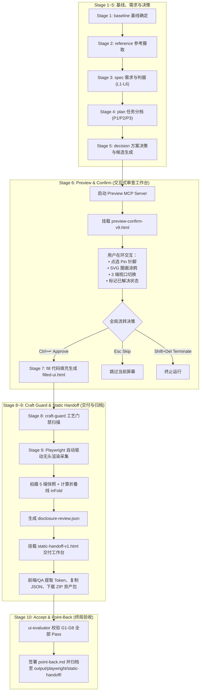
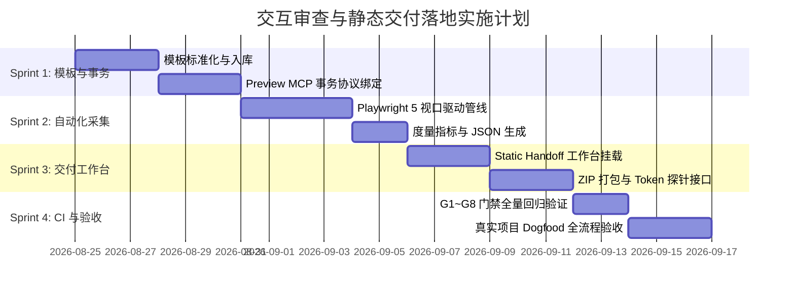

# 交互式审查与静态交付工作台落地方案 (Interactive Review & Static Handoff Implementation Plan)

- **工单/状态**：`#36` · **已定稿** (Approved by Roundtable Review)
- **关联设计原型**：
  - [`.stitch/designs/preview-confirm-v9.html`](file:///d:/code_space/design-playbook-fresh/.stitch/designs/preview-confirm-v9.html) (Stage 6 Preview)
  - [`.stitch/designs/static-handoff-v1.html`](file:///d:/code_space/design-playbook-fresh/.stitch/designs/static-handoff-v1.html) (Stage 9 Static Handoff)
- **Stitch 项目链接**：[Google Stitch Project 4555543666448040473](https://stitch.withgoogle.com/projects/4555543666448040473)
- **设计基线规范**：`Light Mode` · `#2563EB (Primary)` · `Geist / Inter / JetBrains Mono` · `Roundness 4px`
- **关联规范与 ADR**：`ADR-0013 (Preview Transaction)` · `ADR-0017 (Persistent Contract)` · `ADR-0021 (Stage Registry)` · `ADR-0034 (Static Handoff Ownership & Lifecycle)`
- **实施修订**：本文为已定稿的**落地计划**，落地过程中若与 ADR 冲突，**以 ADR 为准**。已发生的偏离逐条记录于 [§0 实施修订记录](#0-实施修订记录-implementation-amendments)。

---

## 0. 实施修订记录 (Implementation Amendments)

落地过程中被上层决策推翻或收窄的条目。每条给出「计划原文 → 实际规范 → 依据」。本节是本文与代码之间的唯一对账口径。

| # | 计划原文 | 实际规范 | 依据 |
| :-- | :--- | :--- | :--- |
| A1 | §3.2 的 `confirm-round-n.json` 示例（`outcome` / `actor` / `annotations` / `viewportTested`） | **非规范**，仅示意。规范形状由 `transaction.py` 落盘：`round` / `report_ref` / `confirmed` / `floor_pass` / `selected_options` / `feedback` / `timestamp` / `prototype_path` / `prototype_html_hash` / `decision_id` | ADR-0013 · ADR-0008（反馈地板）· issue #90 |
| A2 | §4.1「G1~G8 全项 `PASS`」、§7「G1~G8 全量通过 (All Passed)」 | 条件门禁的前置条件若从未发生，状态为 **`not-applicable`**，不计入 `gatesPassed`，也不判为 fail。交付判定看 `gatesResolved`（全部 `pass` 或 `not-applicable`），不看「8/8」 | ADR-0034 §7 · issue #89 |
| A3 | §4.2 `disclosure-review.json` 示例：`decisions[].id` 为 `DD-01`、viewport `metrics` 无测量状态 | 决策 id 带轮次前缀 `DD-R{n}-{seq}`；每个 viewport 的 `metrics` 必带 `measurementStatus`（`measured` / `blocked`），任一维度为 0 即 `blocked` 并阻断 verdict | ADR-0034 §5 · issue #93 |
| A3b | §2 流程图把 Stage 8 标注为「craft-guard 工艺门禁扫描 **(G8)**」 | **G8 是 run-level registry 门禁**（`scripts/g8_run_registry.py`），不是 craft-guard 扫描本身；两者只是触发关系——run 根存在 `craft-guard.md` 时 G8 才求值。已去掉该错误标注 | `scripts/validate_run.py` 门禁清单 · issue #93 |
| A4 | §5「Stage 9 截图驱动」输出至 `output/playwright/static-handoff/` | 全部产物落在 run 树内：`.scratch/<run>/evidence/static-handoff/`，生命周期与任何审查轮次无关 | ADR-0034 §2 · issue #86 |
| A5 | §5「Stage 9 交付页挂载」使用 `.stitch/designs/static-handoff-v1.html`，并由 Preview 提供 `/export-zip` 端点 | 交付页作为包内自有内容随包分发：`packages/design-playbook/mcp/evidence/static_handoff_page.html`（零 CDN）。ZIP 由 Evidence 侧构建器直接落盘为 `static-handoff.zip`，**不存在** HTTP 端点 | ADR-0034 §6 · issue #88 |
| A6 | §4.1 截图矩阵由审查会话驱动 | 截图目标是 **Stage 7 交付物本身**（`filled-ui.html`），不是审查外壳 | ADR-0034 §4 · issue #87 |
| A7 | §5「Stage 10 门禁自校验 · 签署最终 `point-back.md`」隐含归档全部 Stage 9 产物 | Stage 10 只签署与指回，**不**复制或再归档 Stage 9 产物；产物的唯一权威副本留在 run 树内 `evidence/static-handoff/` | ADR-0034 §2（生命周期归属）· issue #92 |

---

## 1. 背景与核心目标 (Context & Objectives)

在 `design-playbook` 端到端十段闭环流水线中，**Stage 6（预览确认与交互审查）** 与 **Stage 9（静态交付与证据导出）** 构成了整套系统最核心的人机交互与工程交付界面：

1. **Stage 6 `preview`（交互式审查决策工作台）**：
   - **目标**：为人机在环审查提供流畅、高保真的原型预览与决策交互，支持精细的 Pin 点选、实时 SVG 圈画涂鸦、三端响应式视口切换与 J/K 键盘漫游，保障审查人员能够快速做出 `Approve`（确认通过）、`Skip`（跳过）或 `Terminate`（终止）决策。
2. **Stage 9 `evidence`（静态交付与证据归档工作台）**：
   - **目标**：在用户确认通过后，自动驱动 Playwright 拍摄 5 端标准快照，完成首屏折叠线与视口溢出检测，提供红线标尺探针、CSS Token 提取及一键打包 ZIP 下载，为前端开发与 QA 验收提供唯一受控的真实工程交付物。

---

## 2. 端到端流水线架构流转 (End-to-End Pipeline State Machine)



---

## 3. Stage 6: 交互式预览确认落地规范 (`preview-confirm-v9.html`)

### 3.1 核心能力与组件映射
- **双向锚定标注 (Two-Way Focus Sync)**：
  - 画布中的 Pin / 圈画与右侧抽屉卡片联动高亮，支持触感物理阴影与自动滚动对齐。
- **实时 SVG 圈画引擎 (Live SVG Loop Engine)**：
  - 按下 <kbd>D</kbd> 激活涂鸦工具，在画布上拖拽任意闭合路径，自动生成带虚线描边的永久图层，并自动聚焦右侧输入框。
- **三端视口切换器 (Viewport Switcher)**：
  - 🖥️ Desktop (1024px) / 💻 Tablet (768px) / 📱 Mobile (375px)，纯 CSS 变换无布局抖动。
- **Figma 级平移与缩放引擎 (Pan & Zoom)**：
  - 支持 <kbd>Space</kbd> + 拖拽、抓手工具 <kbd>H</kbd>、滚轮缩放、<kbd>0</kbd> 一键自适应居中。
- **键盘快速漫游与国际化**：
  - <kbd>J</kbd> / <kbd>K</kbd> 快速在批注项间上下游走；<kbd>L</kbd> 快捷键无感切换中英双语。

### 3.2 决策事务数据契约 (`confirm-round-n.json`)

> **[A1] 下方 JSON 为示意，非规范。** 规范形状见 ADR-0013 与 `packages/design-playbook/mcp/preview/transaction.py`；`confirmed` 必须同时满足用户确认与 ADR-0008 反馈地板。

```json
{
  "round": 3,
  "outcome": "approved",
  "actor": "confirmed-user",
  "timestamp": "2042-06-01T09:30:00+08:00",
  "annotations": [
    {
      "id": 1,
      "target": "section.hero h1",
      "note": "标题感觉不够有冲击力，建议换成「重塑设计工作流」？",
      "resolved": true
    },
    {
      "id": 2,
      "target": ".feature-card:nth(2)",
      "note": "这个卡片的配图太素了，且与另外两个不协调，建议更换为带点蓝色的插画，和主题色呼应。",
      "resolved": false
    }
  ],
  "viewportTested": ["desktop", "tablet", "mobile"]
}
```

---

## 4. Stage 9: 静态交付与证据导出落地规范 (`static-handoff-v1.html`)

### 4.1 核心能力与组件映射
- **5 端响应式快照矩阵 (Multi-Viewport Matrix)**：
  - <kbd>1</kbd> `1280x900` (Desktop)
  - <kbd>2</kbd> `768x1024` (Tablet)
  - <kbd>3</kbd> `390x844` (Mobile Standard)
  - <kbd>4</kbd> `360x800` (Mobile Compact)
  - <kbd>5</kbd> `print` (Print Media 1280)
- **4 种视图呈现模式 (Segmented View Modes)**：
  - <kbd>V</kbd> **纯净渲染 (Clean Render)**
  - <kbd>R</kbd> **红线标尺与 Token 探针 (Redline & CSS Probe)**
  - <kbd>F</kbd> **首屏折叠线检测 (Fold Baseline at 900px)**
  - <kbd>D</kbd> **多端并排对比 (Side-by-Side Diff)**
- **8/8 自动化门禁清单 (G1-G8 Gates Checklist)**：
  - 实时直观呈现当前交付物在 G1~G8 门禁下的验证结果。
  - **[A2 修订]** 条件门禁（G5~G8）的前置条件若从未发生，状态为 `not-applicable`，不计入 `gatesPassed`，也不判为 fail；交付判定看「全部为 `pass` 或 `not-applicable`」，不看「8/8」。
- **一键打包与披露 JSON 导出**：
  - **[A5 修订]** 交付页与 ZIP 均为磁盘产物，页面上的下载为同目录相对链接，无 HTTP 端点：
  - <kbd>C</kbd> 快速复制 `disclosure-review.json`；
  - <kbd>E</kbd> 打开打包导出 ZIP 弹窗，一键下载全套快照与原型代码。

### 4.2 披露审查数据契约 (`disclosure-review.json`)

> **[A3] 下方示例的 `decisions[].id` 与 viewport `metrics` 已过时。** 规范：决策 id 为 `DD-R{轮次}-{序号}`（如 `DD-R1-01`）；每个 viewport 的 `metrics` 必带 `measurementStatus`（`measured` / `blocked`），任一维度测得 0 即 `blocked` 并阻断 verdict。规范实现见 `packages/design-playbook/mcp/evidence/handoff.py`。

```json
{
  "runId": "ws_syn_7F3A",
  "verdict": "Pass",
  "profile": "P2-Standard",
  "authority": "confirmed-user",
  "timestamp": "2042-06-01 09:30 +08:00",
  "decisions": [
    {
      "id": "DD-01",
      "title": "发送前独立双向确认",
      "authority": "confirmed-user"
    },
    {
      "id": "DD-02",
      "title": "写清允许与禁止能力",
      "authority": "confirmed-user"
    }
  ],
  "viewports": [
    {
      "name": "1280x900",
      "metrics": {
        "sw": 1280,
        "innerH": 900,
        "hOverflow": 0,
        "disclosure": { "inFold": true }
      }
    },
    {
      "name": "768x1024",
      "metrics": {
        "sw": 768,
        "innerH": 1024,
        "hOverflow": 0,
        "disclosure": { "inFold": true }
      }
    },
    {
      "name": "390x844",
      "metrics": {
        "sw": 390,
        "innerH": 844,
        "hOverflow": 0,
        "disclosure": { "inFold": true }
      }
    },
    {
      "name": "360x800",
      "metrics": {
        "sw": 360,
        "innerH": 800,
        "hOverflow": 0,
        "disclosure": { "inFold": true }
      }
    },
    {
      "name": "print",
      "metrics": {
        "sw": 960,
        "innerH": 650,
        "hOverflow": 0,
        "disclosure": { "inFold": true }
      }
    }
  ],
  "gatesPassed": 8
}
```

---

## 5. 工程落地点与代码结构映射 (Implementation Map)

| 阶段 / 模块 | 涉及工程代码路径 | 落地方案与修改内容 |
| :--- | :--- | :--- |
| **Stage 6 模板集成** | `packages/design-playbook/mcp/preview/control.html`<br>`packages/design-playbook/mcp/preview/server.py` | • 将 `preview-confirm-v9.html` 集成为默认渲染模板（真实落点为 `control.html`，由 `control.py` 的 `_build_control()` 组装注入）<br/>• 支持通过 WebSocket 双向推送批注与决策事件 |
| **Stage 6 事务持久化** | `packages/design-playbook/mcp/preview/transaction.py`<br>`packages/design-playbook/mcp/preview/integrity.py` | • 校验决策轮次完整性（C1 准则）<br/>• 自动写入 `confirm-round-n.json` |
| **Stage 9 截图驱动** | `packages/design-playbook/mcp/evidence/capture_runtime.py`<br>`packages/design-playbook/mcp/evidence/disclosure.py`<br>`packages/dsh-design-playbook/cordis.patch.yml` | • Playwright 驱动（`PlaywrightBrowserAdapter`）自动遍历 5 视口并截图（`capture_delivery_matrix`）<br/>• 注入 DOM 探针（`LAYOUT_PROBE_JS` / `probe_layout`）计算 `inFold` 与 `hOverflow`，并经 `build_disclosure` 输出 `disclosure-review.json`<br/>• **[A4/A6 修订]** 截图目标为 Stage 7 交付物 `filled-ui.html` 本身（非审查外壳）；产物落在 run 树 `.scratch/<run>/evidence/static-handoff/`，不再使用 `output/playwright/` |
| **Stage 9 交付页挂载** | `packages/design-playbook/mcp/evidence/handoff.py`<br>`packages/design-playbook/mcp/evidence/static_handoff_page.html` | • **[A5 修订]** 交付页作为包内自有内容随包分发（零 CDN），不再引用 `.stitch/designs/static-handoff-v1.html`<br/>• ZIP 由 Evidence 侧构建器 `build_static_handoff` 直接落盘为 `static-handoff.zip`（`build_handoff_zip`），**不存在** `/export-zip` HTTP 端点 |
| **Stage 10 门禁自校验** | `packages/design-playbook/scripts/validate_run.py`<br>`packages/design-playbook/scripts/stages.py` | • 确保 G1~G8 门禁自动对齐<br/>• 签署最终 `point-back.md`<br/>• **[A7 修订]** Stage 10 只签署与指回，**不**复制或再归档 Stage 9 产物；产物唯一权威副本留在 `evidence/static-handoff/` |

---

## 6. 四阶段实施路线图 (Phased Roadmap)



### 🔹 Sprint 1：模板入库与事务协议对齐
- 将 `preview-confirm-v9.html` 集成为 Preview MCP Server 标准模板；
- 完善 `transaction.py`，实现批注与决策的结构化持久化。

### 🔹 Sprint 2：Playwright 自动化采集管线
- 配置 5 视口无头渲染流水线；
- 实现首屏折叠线与水平溢出的自动化度量与 JSON 结构化输出。

### 🔹 Sprint 3：静态交付工作台与打包服务
- **[A5 修订]** 部署包内自有交付页 `mcp/evidence/static_handoff_page.html`（原计划的 `static-handoff-v1.html`）；
- 支持从页面一键提取 Token、复制 JSON 以及生成 ZIP 交付归档包（构建期落盘，非 HTTP 端点）。

### 🔹 Sprint 4：CI 门禁与端到端 Dogfood 实测
- 运行 `python scripts/validate.py` 确保 100% 测试通过；
- 执行完整 Dogfood Run，验证从需求成形、预览确认到静态交付的全流程顺畅度。

---

## 7. 质量保障与门禁验收准则 (Acceptance Criteria)

1. **设计保真度与规范一致性**：
   - 视觉样式、色彩 Token（`#2563EB`）、圆角及字体规范与 Stitch 基线对齐。
   - **[A5 例外]** 包内交付页零 CDN，因此字体降级为系统字体栈（不得引用 Geist / Inter / JetBrains Mono 的远程 webfont）；圆角统一取 `4px`，图表与快照卡片沿用同一半径。
2. **交互完整性与无损回退**：
   - 快捷键矩阵全量可用（包含平移缩放、视口切换、中英切换），键盘与鼠标交互双向可达。
3. **门禁与契约合规**：
   - `python scripts/validate.py` 零错误；
   - **[A2 修订]** G1~G8 门禁矩阵全部**收敛**（每项为 `pass` 或 `not-applicable`，无 `fail`、无 `pending`），契约数据零漂移。原「全量通过 (All Passed)」表述作废——未触发的条件门禁不得计为通过。