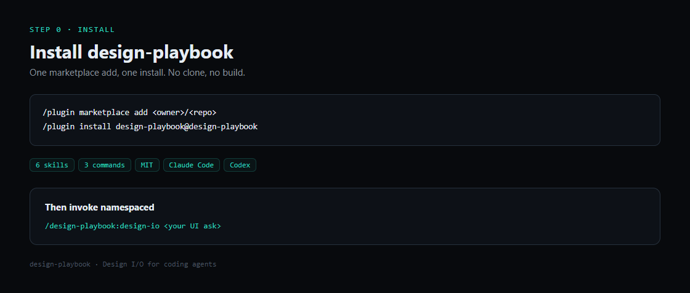
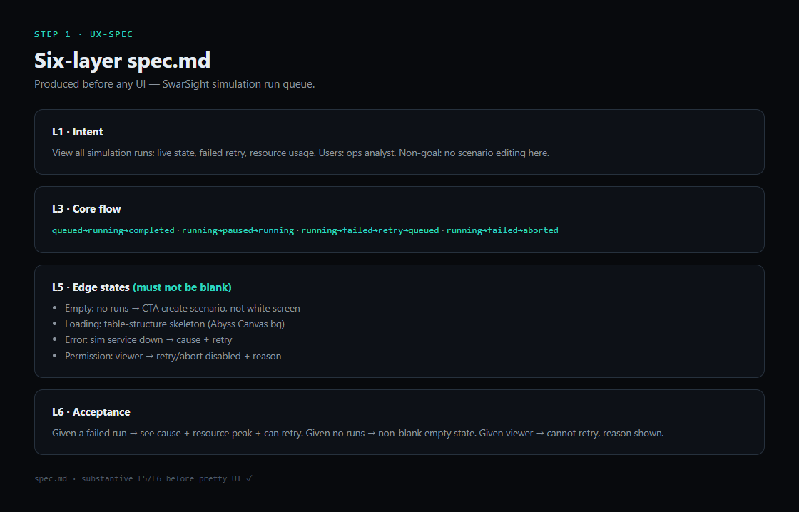
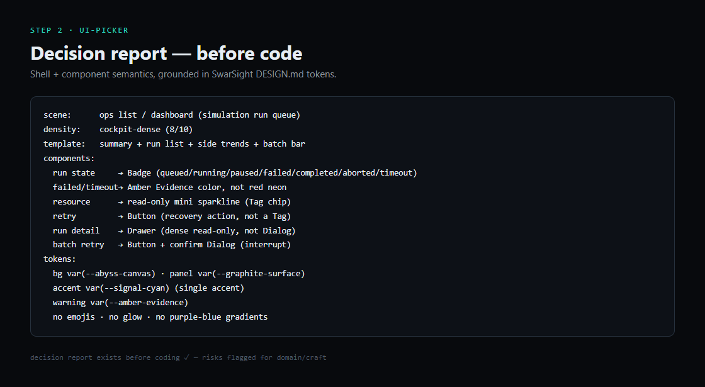
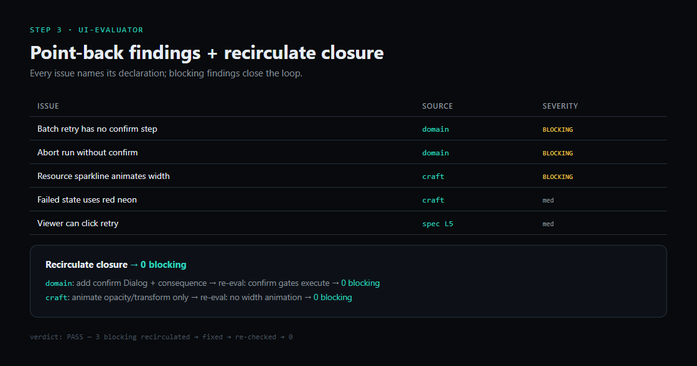
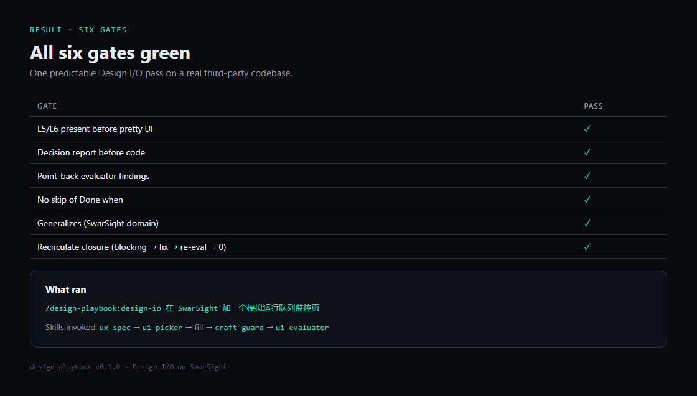

# Showcase - design-playbook on SwarSight

One **demonstrated** Design I/O run against SwarSight (swarm-intelligence foresight platform; React + Tailwind + shadcn workbench). The plugin was loaded from this package and driven against a one-line ask. Screenshots + artifacts below are the output of that single run — a demonstration of the declared contract, not a claim that real UI quality was machine-proven. `scripts/validate_run.py` checks only the run-artifact *shape*; `tests/test_validate_run.py` validates these showcase files directly (not by copying them into fixtures). That proves structure, not that every future run is machine-verified.

**Current orchestrator sequence** (skill SSOT): `reference-intake? → ux-spec? → plan? → (native-craft?) → ui-picker → (preview*) → fill → craft-guard → (observe*) → ui-evaluator`. This showcase run demonstrates the **declaration / decision / point-back** core (spec → decision report → point-back) from a live SwarSight pass; it does **not** include `reference/` intake, a `plan.md` handoff, or `observe*` evidence artifacts. A separate **preview\* HITL** demonstration ([`04-preview-hitl.md`](04-preview-hitl.md)) — sourced from the v0.4 multi-step-form dogfood (007), a **different ask** than the main case — shows G5 (real `preview_prototype` confirm). `observe*` stays dogfood-only (体积 + 漂移负担，待稳定 fixture 化). `preview*`/`observe*` are optional (adapters must expose `preview_prototype` / `execute_capture_plan`); G5/G6 only apply when their artifacts occurred.

**Gate coverage honesty:** G1–G4 shape is validated against these showcase files by `tests/test_validate_run.py`; **G5 is additionally exercised on the showcase preview dir** (`showcase/preview-g5` test, artifacts in [`preview/`](preview/), sourced from dogfood 007). G6 remains covered by the **fixture matrix** under `tests/fixtures/` plus dogfood logs (not by expanding this product case — v0.3 decision: one deep showcase + recirculate trail). For a live run's next step without a second state file, monorepo developers can use the repo-root helper `scripts/run_status.py .scratch/<run>` (repo checkout only — not shipped with the installed plugin).
**Ask:** `在 SwarSight 加一个模拟运行队列监控页：看每个模拟任务的状态、失败重试、资源占用。`

## Screenshots (every key step)

### Step 0 · Install


### Step 1 · ux-spec → six-layer spec


### Step 2 · ui-picker → decision report (before code)


### Step 3 · ui-evaluator → point-back + recirculate closure


### Result · six checks met in this run


## Source artifacts

1. [`01-spec.md`](01-spec.md) - six-layer spec (ux-spec)
2. [`02-decision-report.md`](02-decision-report.md) - shell + component decision (ui-picker)
3. [`03-point-back.md`](03-point-back.md) - point-back findings + closure (ui-evaluator)
4. [`04-preview-hitl.md`](04-preview-hitl.md) - **preview\* HITL 演示**（G5；sourced from dogfood 007，不同 ask）+ [`preview/`](preview/) artifacts

## Six checks met in this run

| Check | Met |
| --- | --- |
| L5/L6 before pretty UI | ✅ |
| Decision report before code | ✅ |
| Point-back evaluator findings | ✅ |
| No skip of Done when | ✅ |
| Generalizes (SwarSight domain) | ✅ |
| Recirculate closure (blocking → fix → re-eval → 0) | ✅ |

> **G5 (preview\*)** is demonstrated separately in [`04-preview-hitl.md`](04-preview-hitl.md) (sourced from dogfood 007, a different ask); this main run predates that addition and had no preview step.

## Regenerate screenshots

```bash
node scripts/screenshot-showcase.mjs   # repo-root script; needs playwright-core + chromium (see header)
```

## Reproduce in your session

```text
/plugin marketplace add <owner>/<repo>
/plugin install design-playbook@design-playbook
/design-playbook:design-io 在 SwarSight 加一个模拟运行队列监控页
```
